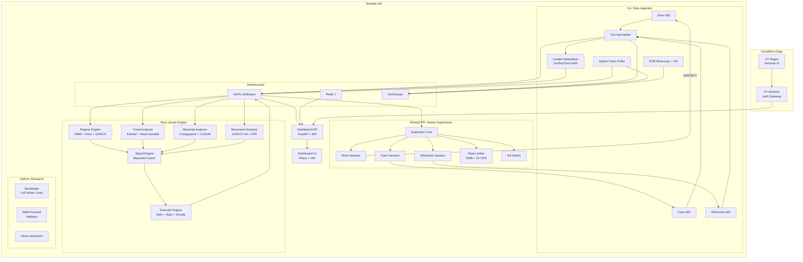
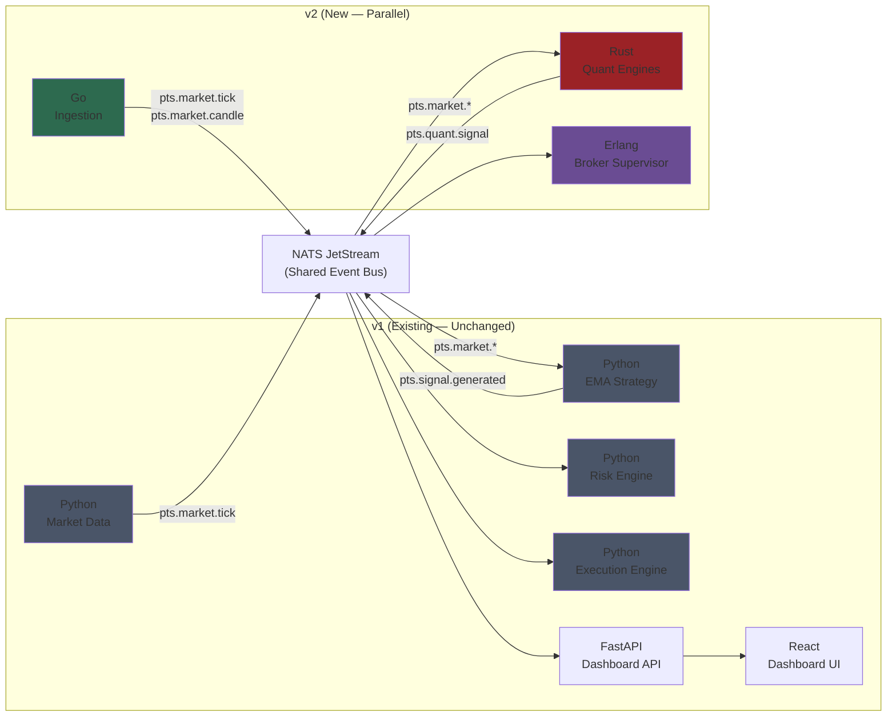
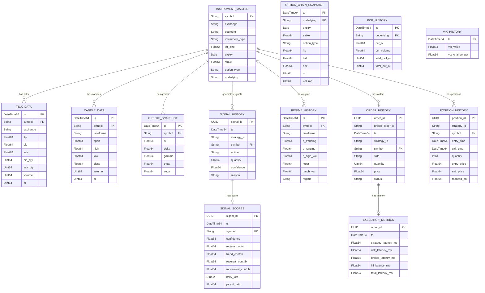
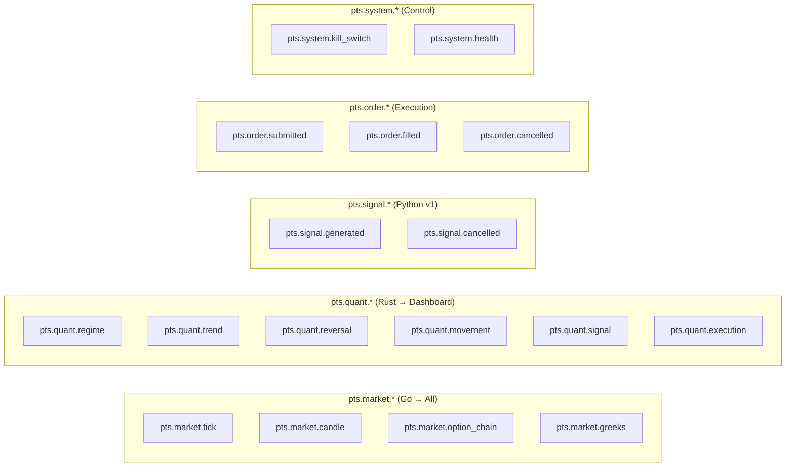
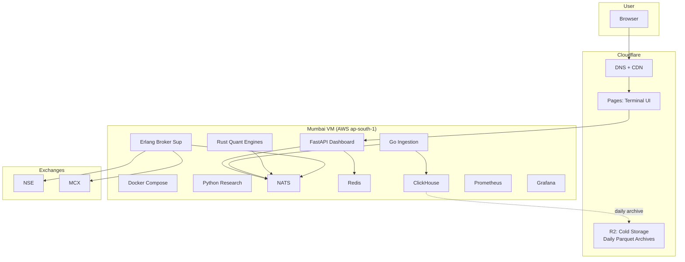

# PTS-004
# Architecture v2.0 — Quant Engine Upgrade
## AutoTrader (Personal Trading System)

Version: 0.1 | Status: Draft

---

## 1. Purpose

Upgrade AutoTrader from a single-strategy Python EMA crossover system to a polyglot,
institutional-grade quantitative trading platform with six mathematical engines,
multi-broker support, and a Bloomberg-like terminal.

**What changes**: The v1 Python strategy engine is replaced by a Rust-based quant engine
pipeline. Go handles data ingestion. Erlang/OTP manages broker connections with fault tolerance.
The existing React dashboard and FastAPI backend continue to serve as the user interface layer.

**What stays the same**: NATS as the event bus, Redis for hot state, ClickHouse for history,
Prometheus + Grafana for metrics, Docker Compose for infrastructure.

---

## 2. System Architecture — v2 Overview

---

## 3. v1 → v2 Integration Map

The v2 system is **additive** — it does not break v1. The existing dashboard continues
to work with v1's Python strategy engine. v2 engines publish to new NATS subjects
(`pts.quant.*`) that the dashboard API can subscribe to alongside existing `pts.signal.*`.

**Migration strategy**: Run v1 and v2 in parallel. v1 continues handling `pts.signal.generated`.
v2's scored signals go through `pts.quant.signal`. The dashboard API subscribes to both.
Once v2 is validated via paper trading, gradually route more capital through v2.

---

## 4. Quant Engine Pipeline — Signal Flow

```mermaid
flowchart TD
    TICK["Tick Event<br/>(every ~100ms)"]
    CANDLE["Candle Event<br/>(1m/5m/15m/1h/4h)"]

    TICK --> REGIME_ENGINE
    CANDLE --> REGIME_ENGINE
    TICK --> TREND_ENGINE
    CANDLE --> TREND_ENGINE

    subgraph "Analysis Layer (parallel per timeframe)"
        REGIME_ENGINE["🔴 Regime Engine<br/>P(trending), P(ranging), P(high_vol)<br/>Hurst exponent, GARCH variance"]
        TREND_ENGINE["🟢 Trend Analyzer<br/>Kalman slope, R², Mann-Kendall p-value<br/>Direction + Strength"]
        REVERSAL_ENGINE["🟡 Reversal Analyzer<br/>P(reversal within N bars)<br/>CUSUM, OI/Vol divergence"]
        MOVEMENT_ENGINE["🔵 Movement Analyzer<br/>GARCH vol, ATR, implied move<br/>Expected range"]
    end

    TICK --> REVERSAL_ENGINE
    TICK --> MOVEMENT_ENGINE

    REGIME_ENGINE --> FUSION
    TREND_ENGINE --> FUSION
    REVERSAL_ENGINE --> FUSION
    MOVEMENT_ENGINE --> FUSION

    subgraph "Decision Layer"
        FUSION["Bayesian Fusion<br/>P(signal_correct | all_evidence)<br/>Confidence decomposition"]
        FILTER["Confidence Filter<br/>Only trade above threshold"]
        CALIBRATION["Brier Score<br/>Calibration tracking"]
    end

    FUSION --> FILTER
    FUSION --> CALIBRATION
    FILTER --> EXECUTOR_ENGINE

    subgraph "Execution Layer"
        EXECUTOR_ENGINE["Executor Engine<br/>Kelly sizing → Risk check → OPS throttle"]
    end

    EXECUTOR_ENGINE --> ORDER["Order Intent<br/>→ Erlang Broker Supervisor"]

    style REGIME_ENGINE fill:#9b2226
    style TREND_ENGINE fill:#2d6a4f
    style REVERSAL_ENGINE fill:#e9c46a,color:#000
    style MOVEMENT_ENGINE fill:#264653
    style FUSION fill:#6a4c93
```

---

## 5. Entity-Relationship Diagram (ClickHouse)

---

## 6. NATS Subject Topology

---

## 7. Deployment Architecture

---

## 8. Technology Stack — v2

| Layer | Technology | Purpose |
|-------|-----------|---------|
| **Quant Engines** | Rust (workspace, 6 crates) | Sub-ms math: HMM, Kalman, GARCH, Bayesian fusion |
| **Data Ingestion** | Go | High-throughput tick ingestion, candle materialization |
| **Broker Mgmt** | Erlang/OTP | Fault-tolerant supervisor trees, auto-reconnect, rate limiting |
| **Research** | Python | Backtesting, walk-forward validation, strategy prototyping |
| **Event Bus** | NATS JetStream | Persistent event streaming with replay |
| **Hot State** | Redis 7 | Live positions, portfolio, prices, regime |
| **Cold Storage** | ClickHouse | Tick history, signals, orders, analytics (partitioned by month) |
| **Archive** | Cloudflare R2 | Daily Parquet snapshots for research |
| **Dashboard API** | FastAPI (Python) | REST + WebSocket for React frontend |
| **Dashboard UI** | React 18 + Vite | Bloomberg-like terminal |
| **Monitoring** | Prometheus + Grafana | Infrastructure + trading metrics |
| **Deployment** | Docker Compose → Mumbai VM | Low-latency to NSE |

---

## 9. Redis Key Design — v2 Extensions

| Key Pattern | Type | Purpose |
|-------------|------|---------|
| `pts:regime:{symbol}:{timeframe}` | Hash | Current regime state per symbol |
| `pts:trend:{symbol}:{timeframe}` | Hash | Current trend state |
| `pts:reversal:{symbol}` | Hash | Current reversal probability |
| `pts:movement:{symbol}` | Hash | Current movement forecast |
| `pts:signal:scored:latest` | List | Last N scored signals |
| `pts:calibration:brier` | String | Current Brier score |
| `pts:prices:live` | Hash | (existing) Live prices |
| `pts:positions:active` | Hash | (existing) Active positions |
| `pts:portfolio:current` | String | (existing) Portfolio state |

---

## 10. Guiding Principles — v2

1. **v1 and v2 coexist** — NATS decoupling means both can run in parallel.
2. **Each language does what it's best at** — Rust for math, Go for I/O, Erlang for reliability, Python for research.
3. **Calibrated probabilities, not certainty** — Track Brier scores. Act only when confidence is high and sizing is correct.
4. **The regime engine gates everything** — No trend/reversal/movement signal fires without knowing the current regime.
5. **Paper trade 4-8 weeks before real capital** — Always.

